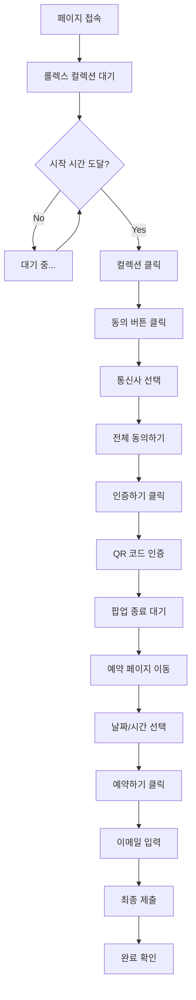

# 🔥 롤렉스 자동화 시스템 v2.0

> 🚀 **차세대 시간 기반 자동화** - 정확한 타이밍과 지능형 처리로 완벽한 예약 시스템

## ✨ 주요 기능

### 🎯 시간 기반 자동화
- **정밀 타이밍**: 설정된 시간까지 대기 후 정확한 순간에 자동화 시작
- **1분 단위 설정**: 초 단위까지 정확한 시간 제어
- **다중 매장 동시 실행**: 병렬 처리로 성공률 극대화

### 🔐 지능형 PASS 인증
- **자동 통신사 선택**: SKT, KT, LGU+ 자동 감지 및 선택
- **전체 동의 자동화**: 약관 동의 단계 자동 처리
- **QR 코드 인증 지원**: 사용자 개입 시점만 명확히 안내
- **팝업 상태 모니터링**: 인증 완료 자동 감지

### 🌐 네트워크 안정성
- **지능형 재시도**: 실패 시 자동 재시도 (지수 백오프)
- **네트워크 상태 감지**: 렉 발생 시 자동 새로고침
- **성능 모니터링**: 페이지 로딩 시간 및 안정성 추적

### 🧠 스마트 선택 시스템
- **유사한 시간 찾기**: 설정 시간 ±30분 범위에서 최적 선택
- **날짜 자동 매칭**: 설정 날짜 ±3일 범위에서 가능한 날짜 선택
- **이메일 자동 입력**: 최종 단계 자동 완료

## 🚀 시작하기

### 환경 요구사항
- **운영체제**: Windows 10+, macOS 10.15+, Linux
- **Rust**: 1.70+ (자동 설치)
- **Node.js**: 18+ (프론트엔드용)
- **브라우저**: Chrome/Chromium 기반

### 설치 및 실행

```bash
# 1. 프로젝트 클론
git clone https://github.com/your-repo/rolex-automation.git
cd rolex-automation

# 2. 백엔드 의존성 설치
cd tauri-app/src-tauri
cargo build

# 3. 프론트엔드 의존성 설치
cd ../
npm install

# 4. 개발 모드 실행
npm run tauri dev

# 5. 프로덕션 빌드
npm run tauri build
```

## ⚙️ 사용 방법

### 1단계: 계정 설정
1. 앱 실행 후 로그인/회원가입
2. **설정** → **개인 정보 설정**
3. 이메일, 통신사, 문의 메시지 입력

### 2단계: 매장별 설정
1. **설정** → **매장별 예약 설정**
2. 각 매장별로 설정:
   - **🚀 자동화 시작 시간**: 정확한 실행 시간 (1분 단위)
   - **📅 방문 날짜**: 원하는 방문 날짜
   - **🕐 방문 시간**: 희망 방문 시간

### 3단계: 자동화 실행
1. **대시보드**에서 원하는 매장 선택
2. **일괄 시작** 버튼 클릭
3. 설정된 시간까지 자동 대기
4. QR 코드 인증 시점에 모바일로 인증 완료

## 📋 자동화 플로우



## 🎯 성능 최적화

### 타이밍 전략
- **10:00**: 매장 오픈, 경쟁 치열하지만 성공률 높음
- **14:00**: 점심 이후, 균형잡힌 선택
- **16:00**: 오후 시간, 여유로운 상담 가능

### 성공률 향상 팁
1. **다중 매장 동시 실행**: 5-10개 매장 병렬 처리
2. **안정적인 네트워크**: 유선 인터넷 권장
3. **모바일 앱 준비**: PASS 앱 미리 로그인
4. **정확한 시간 설정**: 초 단위 정밀도 중요

## 🔧 기술 스택

### Backend (Rust)
- **Tauri**: 크로스 플랫폼 데스크톱 앱
- **headless_chrome**: 브라우저 자동화
- **tokio**: 비동기 런타임
- **serde**: JSON 직렬화/역직렬화
- **chrono**: 날짜/시간 처리

### Frontend (React + TypeScript)
- **React 18**: 모던 UI 프레임워크
- **Material-UI**: 고급 UI 컴포넌트
- **TypeScript**: 타입 안전성
- **React Router**: 클라이언트 사이드 라우팅

### 주요 라이브러리
```toml
[dependencies]
tauri = { version = "2.5.1", features = [] }
headless_chrome = "1.0"
tokio = { version = "1", features = ["time"] }
chrono = { version = "0.4", features = ["serde"] }
serde = { version = "1", features = ["derive"] }
regex = "1.10"
```

## 🔐 보안 및 개인정보

### 데이터 보호
- ✅ 비밀번호 로컬 암호화 저장
- ✅ 개인정보 네트워크 전송 최소화
- ✅ 브라우저 수동 제어 항상 가능
- ✅ 사용자 동의 없는 데이터 수집 금지

### 안전한 자동화
- ✅ 투명한 자동화 과정
- ✅ 언제든 중지 가능
- ✅ 로그 기록으로 추적 가능
- ✅ PASS 인증은 사용자 직접 수행

## 📊 모니터링 및 로그

### 실시간 대시보드
- 📈 매장별 실행 상태
- 📝 상세 실행 로그
- ⏱️ 성능 메트릭
- 🎯 성공률 통계

### 로그 레벨
- **INFO**: 일반 진행 상황
- **SUCCESS**: 단계 완료
- **ERROR**: 오류 및 실패
- **WARNING**: 주의 사항

## 🆘 문제 해결

### 자주 발생하는 문제

#### 1. PASS 인증 팝업이 열리지 않음
**해결법**: 브라우저 팝업 차단 해제, 페이지 새로고침

#### 2. 네트워크 타임아웃
**해결법**: 인터넷 연결 확인, 자동 재시도 대기

#### 3. 시간 선택 실패
**해결법**: 유사한 시간대 자동 선택 기능 활용

#### 4. 브라우저 크래시
**해결법**: 시스템 리소스 확인, 브라우저 재시작

### 지원 채널
- 📧 이메일: support@rolex-automation.com
- 💬 Discord: [커뮤니티 링크]
- 📋 GitHub Issues: 버그 리포트 및 기능 요청

## 📈 로드맵

### v2.1 (예정)
- 🔄 AI 기반 최적 시간 추천
- 📊 성공률 분석 대시보드
- 🔔 실시간 알림 시스템
- 🌍 다국어 지원

### v2.2 (예정)
- 📱 모바일 앱 연동
- ☁️ 클라우드 설정 동기화
- 🤖 머신러닝 기반 예측
- 🔗 API 통합 지원

## 📄 라이센스

MIT License - 자유롭게 사용, 수정, 배포 가능

## 🤝 기여하기

1. Fork the Project
2. Create your Feature Branch (`git checkout -b feature/AmazingFeature`)
3. Commit your Changes (`git commit -m 'Add some AmazingFeature'`)
4. Push to the Branch (`git push origin feature/AmazingFeature`)
5. Open a Pull Request

## 👥 팀

- **Lead Developer**: [@yourname](https://github.com/yourname)
- **UI/UX Designer**: [@designer](https://github.com/designer)
- **QA Engineer**: [@tester](https://github.com/tester)

---

<div align="center">

**🔥 롤렉스 자동화 시스템 v2.0**

*정확한 타이밍, 지능형 처리, 완벽한 예약*

[](https://github.com/your-repo/rolex-automation)
[](LICENSE)
[](CHANGELOG.md)

</div>